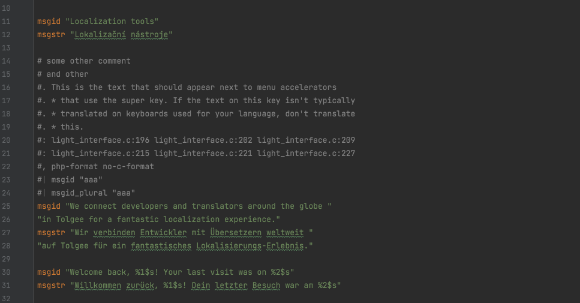
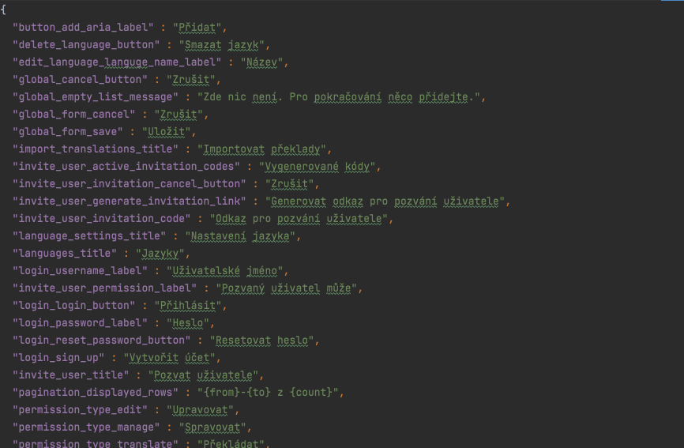
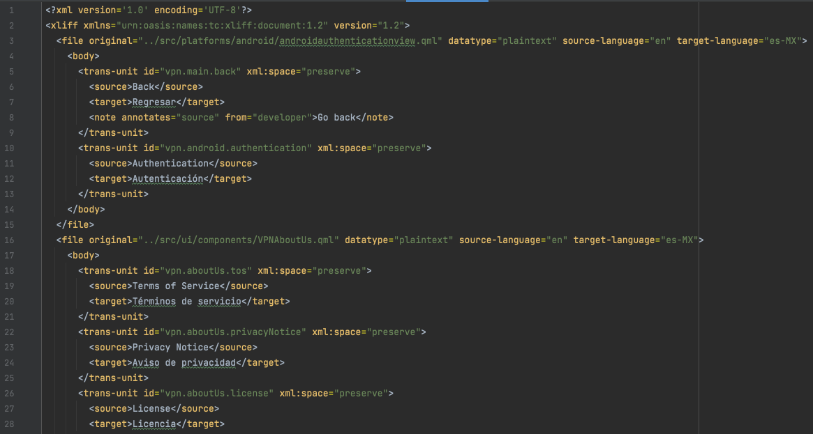

<style>
section { 
font-family: -apple-system, BlinkMacSystemFont, "Segoe UI", Roboto, Helvetica, Arial, sans-serif, "Apple Color Emoji", "Segoe UI Emoji", "Segoe UI Symbol";
font-weight: 200;
}
h1, h2, h3{
font-weight: 300 !important;
}
h1, h2{
color: #5e203f !important;
}
a {
color: #743455 !important;
}
section pre{
border: 1px solid rgba(226,226,226,0.6);
background-color: rgba(88,50,73,0.03);

}
</style>


## Open-source lokalizace webových aplikací levou zadní <!-- fit -->

Jan Cizmar

[tolgee.io/t/2021-11-07-openalt-online.html](https://tolgee.io/t/2021-11-07-openalt-online.html)

---

<h2 style="text-align: center">
   Tolgee je open-source nástroj, který zjednodušuje proces překladu
   webových aplikací do různých světových jazyků jak to jen jde.
</h2>

---

# Topics

- Běžný proces lokalizace
- Ukázka jak to dělat s Tolgee  (DEMO)
- ICU message format
- Příprava aplikace na produkci
- Jiné nástroje

---
# Běžný proces lokalizace <!-- fit -->
---

## Přidání nového textu pro překlad

1. Vytvoření klíče ve zdrojovém kódu

        homepage_hello_world

2. Přidání klíče do lokalizačních souborů (.json, .po, .xliff) ručně nebo pomocí extrakce ➕

---





---

## Přidání nového textu pro překlad

1. Vytvoření klíče ve zdrojovém kódu

        homepage_hello_world

2. Přidání klíče do lokalizačních souborů (.json, .po, .xliff) ručně nebo pomocí extrakce ➕ 
3. Přeložení do mateřského jazyka ✏️ 
4. Kontrola, jestli je přeloženo správně a jesli jsem nerozbil layout ✅

---

## Úprava existujích textů

1. Zjisit, o který klíč se jedná 🕵️
2. Otevřít a upravit lokalizační soubory ✏️
3. Zkontrolovat, že je text přeložen správně a jeslti jsem nerozbil layout ✅

---

## Přeložení překladatelem

1. Vzít lokalizační data a poskytnout je překladateli
2. Odpovědět na velkou spoustu otázek týkajících se kontextu ⁉️

---

- He had glasses on his eyes -> Měl na očích skleničky ⁉️
- Save -> uložit || ušetřit ⁉️

---

## Přeložení překladatelem

1. Vzít lokalizační data a poskytnout je překladateli
2. Odpovědět na velkou spoustu otázek týkajících se kontextu ⁉️
3. Získat špatné překlady od překladatele ❌
4. Vložit je do kódu

---

# Náš způsob

- Vývojaří vyvíjejí 👩‍💻👨‍💻
- Překladatelé překládají 👩‍💻👨‍💻

---

# Demo

---

# Integrace do projektu <!-- fit -->

---

# ICU (International Components for Unicode) Message Format

```
Hello, I am {name}.
```

name=Peter → Hello, I am Peter.

```
{dogsCount, plural, 
   one {One dog is}
   other {# dogs are}
} here.
```

dogsCount=1 → One dog is here.

dogsCount=0 → 0 dogs are here.

dogsCount=2 → 2 dogs are here.

...

---

```
{gender_of_host, select,
  female {
    {num_guests, plural, offset:1
      =0 {{host} does not give a party.}
      =1 {{host} invites {guest} to her party.}
      =2 {{host} invites {guest} and one other person to her party.}
      other {{host} invites {guest} and # other people to her party.}}}
  male {
    {num_guests, plural, offset:1
      =0 {{host} does not give a party.}
      =1 {{host} invites {guest} to his party.}
      =2 {{host} invites {guest} and one other person to his party.}
      other {{host} invites {guest} and # other people to his party.}}}
  other {
    {num_guests, plural, offset:1
      =0 {{host} does not give a party.}
      =1 {{host} invites {guest} to their party.}
      =2 {{host} invites {guest} and one other person to their party.}
      other {{host} invites {guest} and # other people to their party.}}}}
```

[More about ICU message format (https://tolgee.io/docs/icu_message_format)](https://tolgee.io/docs/icu_message_format)

---

# Preparing App for production <!-- fit -->

---

# Tolgee Architecture

- REST API
- Web application
- SDKs

---

# Deployment

<div style="display: flex; width: 100%; text-align: center; margin-top: 50px">
<div style="text-align: center; flex-grow: 1">
Locally
<div style="font-size: 100px; text-align: center">
👤
</div>

    docker run -p8080:8080 tolgee/tolgee

</div>
<div style="text-align: center; flex-grow: 1; margin: 0 40px">
Your cloud infrastructure
<div style="font-size: 100px; text-align: center">
🏢
</div>
<div style="font-size: 20px">

    docker-compose up

</div>
</div>
<div style="text-align: center; flex-grow: 1">
Use Tolgee Cloud
<div style="font-size: 100px; text-align: center">
☁
</div>

[https://app.tolgee.io](https://app.tolgee.io)

</div>
</div>

---

# Budoucnost

- Glosáře, překladová paměť, automatizované překlady
- Podpora mobilních a desktopových aplikací
- Pluginy do IDE a nástrojů pro designování (Figma, XD)

---

## Technologie

<div style="display: flex; justify-content: space-around; flex-direction: column; margin-top: 50px">
<div style="display: flex; justify-content: space-around">


</div>
<div style="display: flex; justify-content: space-around; margin-top: 30px">


</div>
<div style="display: flex; justify-content: space-around; margin-top: 30px">


</div>
</div>

---

# Proprietární nástoje

- Crowdin
- Lokalise
- Phrase
- Many more

# Open-source nástroje

- Weblate
- Pontoon

---
<div style="display: flex">
<div>

## Dokumentace

https://tolgee.io

## Napište mi

cizmar@tolgee.io

## Github

<div style="display: flex">

[github.com/tolgee/server](https://github.com/tolgee/server)
<div style="margin-left: 10px">
<!-- Place this tag where you want the button to render. -->
<a style="margin-left: 20px" class="github-button" href="https://github.com/tolgee/server" data-icon="octicon-star" data-size="large" aria-label="Star tolgee/server on GitHub">Star</a>
</div>
</div>
<div style="display: flex">

[github.com/tolgee/tolgee-js](https://github.com/tolgee/tolgee-js)
<!-- Place this tag where you want the button to render. -->
<div style="margin-left: 10px">
<a class="github-button" href="https://github.com/tolgee/server" data-icon="octicon-star" data-size="large" aria-label="Star tolgee/server on GitHub">Star</a>
</div>
</div>

## Slidy

[tolgee.io/t/2021-11-07-openalt-online.html](https://tolgee.io/t/2021-11-07-openalt-online.html)

</div>
<div style="display: flex; flex-grow: 1; justify-content: center; align-items: center">


</div>
</div>
<!-- Place this tag in your head or just before your close body tag. -->
<script async defer src="https://buttons.github.io/buttons.js"></script>
