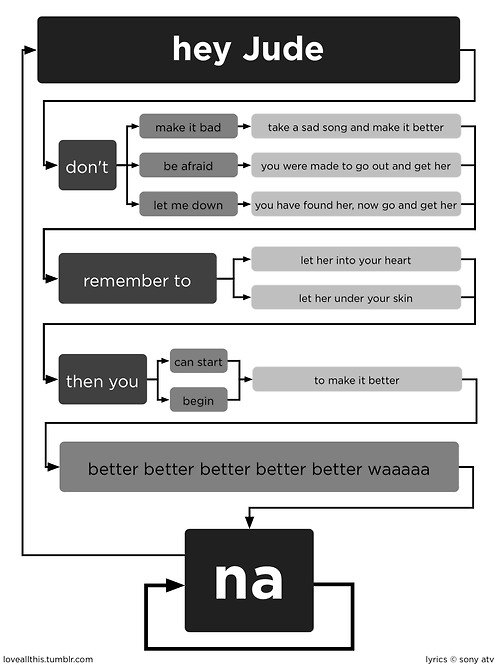
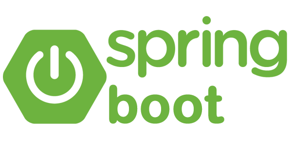
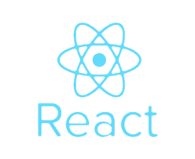
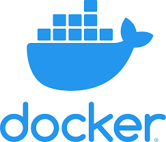

<style>
section { 
font-family: -apple-system, BlinkMacSystemFont, "Segoe UI", Roboto, Helvetica, Arial, sans-serif, "Apple Color Emoji", "Segoe UI Emoji", "Segoe UI Symbol";
font-weight: 200;
}
h1, h2, h3{
font-weight: 300 !important;
}
h1, h2{
color: #5e203f !important;
}
a {
color: #743455 !important;
}
section pre{
border: 1px solid rgba(226,226,226,0.6);
background-color: rgba(88,50,73,0.03);

}
</style>


## Web Application Localization Without Tears 😢 <!-- fit -->

Jan Cizmar

---

<h2 style="text-align: center">
   Tolgee is open-source tool simplifying localization process as much as possible
</h2>

---
# Common localization process <!-- fit -->
---

## Adding a new text to translate

1. Create translation key in the code

        homepage_hello_world

2. Add the key to the file with localization data or use extraction ➕
3. Translate the key to your mother language ✏️
4. Check it was translated correctly, it looks fine and layout is not broken ✅

---

## Modifying existing translation

1. Find out which key it is 🕵️
2. Open the localization file, and modify the value ✏️
3. Check it was translated correctly, it looks fine and layout is not broken ✅

---

## Letting a translator to translate your app into foreign language

1. Take the localization data from your code & send it to translator
2. Answer a lot of questions about context of the data ⁉️
---

<div style="text-align: center">


</div>

---

<div style="text-align: center">


</div>

---

## Letting a translator to translate your app into foreign language

1. Take the localization data from your code & send it to translator
2. Answer a lot of questions about context of the data ⁉️
3. Get wrong translations because of missing context ❌
4. Append the data to the code
---

<div style="text-align: center">



</div>

---

# The Tolgee method

- Developers develop their code 🧑‍💻
- Translators translate 👩‍💻

---

# Localization process with Tolgee (Demo)

---

# ICU Message Format

```
Hello, I am {name}.
```

name=Peter → Hello, I am Peter.

```
{dogsCount, plural, 
   one {One dog is}
   other {# dogs are}
} here.
```

dogsCount=1 → One dog is here.
dogsCount=0 → 0 dogs are here. 
dogsCount=2 → 2 dogs are here. 
...

---

```
{gender_of_host, select,
  female {
    {num_guests, plural, offset:1
      =0 {{host} does not give a party.}
      =1 {{host} invites {guest} to her party.}
      =2 {{host} invites {guest} and one other person to her party.}
      other {{host} invites {guest} and # other people to her party.}}}
  male {
    {num_guests, plural, offset:1
      =0 {{host} does not give a party.}
      =1 {{host} invites {guest} to his party.}
      =2 {{host} invites {guest} and one other person to his party.}
      other {{host} invites {guest} and # other people to his party.}}}
  other {
    {num_guests, plural, offset:1
      =0 {{host} does not give a party.}
      =1 {{host} invites {guest} to their party.}
      =2 {{host} invites {guest} and one other person to their party.}
      other {{host} invites {guest} and # other people to their party.}}}}
```

[More about ICU message format (https://tolgee.io/docs/icu_message_format)](https://tolgee.io/docs/icu_message_format)

---

# Tolgee Architecture

- REST API
- Web application
- SDKs

---

# Single source of truth

- All developers & translators use the same localization data
- The data may but don't have to be stored in VCS

---

# Deployment

<div style="display: flex; width: 100%; text-align: center; margin-top: 50px">
<div style="text-align: center; flex-grow: 1">
Locally
<div style="font-size: 100px; text-align: center">
👤
</div>

    docker run -p8080:8080 tolgee/tolgee

</div>
<div style="text-align: center; flex-grow: 1; margin: 0 40px">
Your cloud infrastructure
<div style="font-size: 100px; text-align: center">
🏢
</div>
<div style="font-size: 20px">

    docker-compose up

</div>
</div>
<div style="text-align: center; flex-grow: 1">
Use Tolgee Cloud
<div style="font-size: 100px; text-align: center">
☁
</div>

[https://app.tolgee.io](https://app.tolgee.io)

</div>
</div>

---

# The Future

- Automatic screenshot generation
- Glossaries, Translation Memory, Automated translations
- Plugins for IDE & Design tools
- Support for mobile and desktop apps

---

## Technologies

<div style="display: flex; justify-content: space-around; flex-direction: column; margin-top: 50px">
<div style="display: flex; justify-content: space-around">





</div>
<div style="display: flex; justify-content: space-around; margin-top: 30px">





</div>
<div style="display: flex; justify-content: space-around; margin-top: 30px">




</div>
</div>

---

# Proprietary tools

- Crowdin
- Lokalise
- Phrase
- Many more

---
# Question time!

cizmar@tolgee.io
https://tolgee.io
